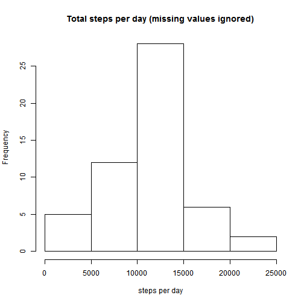
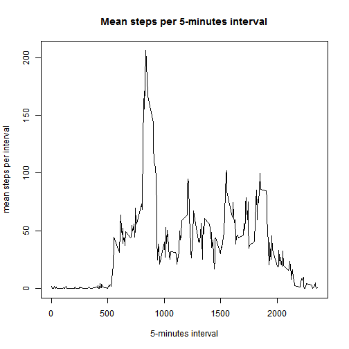
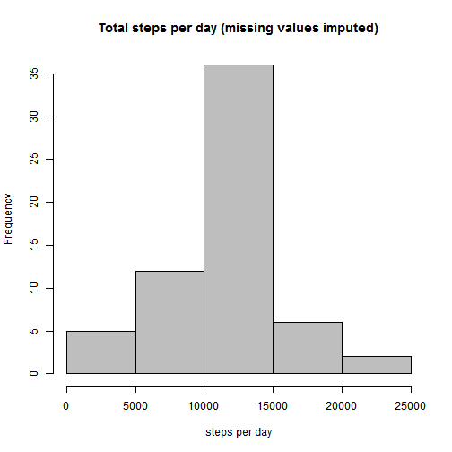
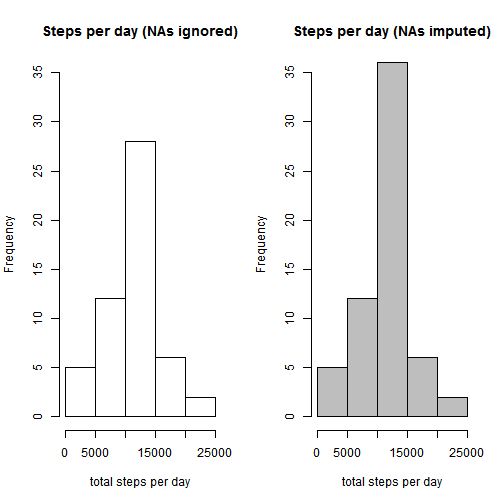
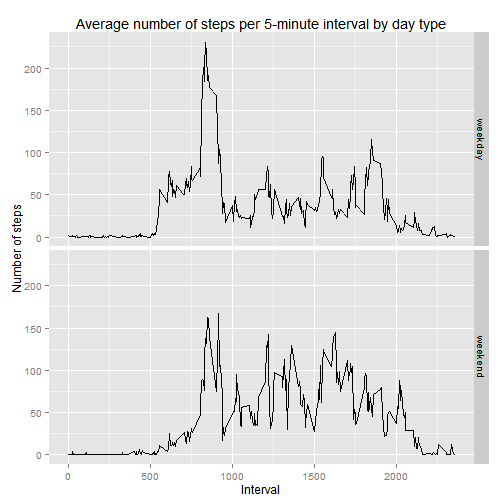

# Reproducible Research: Peer Assessment 1
For this assignment, data file (*activity.csv*) is supossed to be in the working directory. This assignment makes use of data from a personal activity monitoring device. This device collects data at 5 minute intervals through out the day. The data consists of two months of data from an anonymous individual collected during the months of October and November, 2012 and include the number of steps taken in 5 minute intervals each day.  
  
The variables included in this dataset are:

* **steps**: Number of steps taking in a 5-minute interval (missing
    values are coded as `NA`)

* **date**: The date on which the measurement was taken in YYYY-MM-DD
    format

* **interval**: Identifier for the 5-minute interval in which
    measurement was taken
  
  


## Loading and preprocessing the data

```r
# Read data and check characteristics of the variables 
data0<-read.csv("activity.csv")
str(data0)
```

```
## 'data.frame':	17568 obs. of  3 variables:
##  $ steps   : int  NA NA NA NA NA NA NA NA NA NA ...
##  $ date    : Factor w/ 61 levels "2012-10-01","2012-10-02",..: 1 1 1 1 1 1 1 1 1 1 ...
##  $ interval: int  0 5 10 15 20 25 30 35 40 45 ...
```
The dataset is stored in a comma-separated-value (CSV) file and there
are a total of 17568 observations.   

## What is mean total number of steps taken per day?

```r
# Ignore missing values
data0.complete<-data0[complete.cases(data0),]
# Create a new dataset, stepsperday, containing variables 'date' and 'totalsteps'
stepsperday<-aggregate(data0.complete$steps,list(data0.complete$date),sum)
colnames(stepsperday)<-c("date","totalsteps")
```
  
The next step is to calculate the total number of steps taken per day (missing values are ignored). In order to do that, `aggregate` function is used and variable names are reintroduced to increase readability of the new dataset.  


```r
# Make a histogram of the total number of steps taken each day
hist(stepsperday$totalsteps,
     main="Total steps per day (missing values ignored)",xlab="steps per day")
```

 
  
Looking at the histogram of the total number of steps taken each day, we can see a quite simetric distribution and a remarkable difference between the frequency of central values and the rest.  


```r
#Calculate the mean and median of the total number of steps taken per day
meansteps<-mean(stepsperday$totalsteps)
mediansteps<-median(stepsperday$totalsteps)
```
  
The **mean total number of steps** taken per day is **10766.19** and the median is 10765.  

## What is the average daily activity pattern?

```r
# Create a new dataset, stepsperint, containing variables 'interval' and 'meansteps'
stepsperint<-aggregate(data0.complete$steps,list(data0.complete$interval),mean)
colnames(stepsperint)<-c("interval","meansteps")
```
  
In order to show the average daily activity pattern, a new dataset of mean steps per interval is created. Again, `aggregate` function is used and variable names are reintroduced to increase readability of the new dataset.  


```r
# Make a plot of the 5-minute interval and the average number of steps taken,
# averaged across all days
plot(stepsperint$interval,stepsperint$meansteps,type="l",
     main="Mean steps per 5-minutes interval",
     xlab="5-minutes interval",ylab="mean steps per interval")
```

 
  
Looking at the time series plot of the 5-minute interval and the average number of steps taken, averaged across all days, we can see there is no activity at night, between 00:00 and 5:00 AM, and a big peak of activity early in the morning. Activity keeps going through the day, until 8:00 P.M, when it decreases remarkably.  


```r
# Find the interval containing the maximum number of steps and the number of steps
# taken in that interval 
maxint<-stepsperint$interval[which.max(stepsperint$meansteps)]
maxsteps<-max(stepsperint$meansteps)
```
  
The **5-minute interval**, on average across all the days in the dataset, containing the **maximum number of steps** is 835. It means that the maximum number of steps on average is taken between 8:35 and 8:40 A.M. The average number of steps taken in this interval is 206.17.  
  
## Imputing missing values

```r
# Calculate the total number of rows with NAs
numberNAs<-sum(!complete.cases(data0))
```
  
The presence of missing values may introduce bias into some calculations or summaries of the data. In this dataset, there are 2304 missing values, coded as `NA`, all of them in the variable *steps*.  


```r
# Separate dataset in two parts (with and without NAs)
data0.isna<-data0[is.na(data0$steps),]
data0.notna<-data0[!is.na(data0$steps),]
# Replace NAs with the mean steps per interval
replace.na<-merge(stepsperint,data0.isna,by="interval")
replace.na$steps<-replace.na$meansteps
replace.na$meansteps<-NULL
replace.na<-replace.na[,c("steps","date","interval")]
# Create new dataset with the missing data filled in
filled.data<-rbind(replace.na,data0.notna)
filled.data<-filled.data[order(filled.data$date,filled.data$interval),]
```
  
In order to fill in all of the missing values in the dataset, every `NA`value is replaced with the mean for that 5-minute interval. Then, a new dataset, *filled.data* is created. This new dataset is equal to the original dataset but with the missing data filled in.  


```r
# Create a new dataset, new.stepsperday, containing variables 'date' and 
# 'totalsteps, based on the dataset with missing values filled in
new.stepsperday<-aggregate(filled.data$steps,list(filled.data$date),sum)
colnames(new.stepsperday)<-c("date","totalsteps")
# Make a histogram of the total number of steps taken each day, based on 
# the dataset with missing values filled in
hist(new.stepsperday$totalsteps,
     main="Total steps per day (missing values imputed)",
     xlab="steps per day",col="grey")
```

 

The histogram of the total steps per day, when missing values are imputed this way, shows a similar distribution to the previous one, but the frequency of center values is higher.  


```r
# Calculate new mean and median (with missing values imputed)
new.meansteps<-mean(new.stepsperday$totalsteps)
new.mediansteps<-median(new.stepsperday$totalsteps)
```

Now, with `NA` values replaced with the mean for that 5-minute interval, mean and median total number of steps taken per day does not differ significantly from the previous ones. Before imputation, ignoring missing values, the mean total number of steps taken per day does is 10766.19, and after the imputation is 10766.19, exactly the same value. In the median case, before imputation, ignoring missing values, the median total number of steps taken per day does is 10765, and after the imputation is 10766.19, a very similar value. This means that the center of the distribution does not change with the imputation.

In general terms, **the impact of imputing missing data** on the estimates of the total daily number of steps is a distribution with similar measures of centrality and a little higher kurtosis, as shown in the following histograms. 


```r
# Make a two-panel histogram to compare distributions
par(mfrow=c(1,2))
hist(stepsperday$totalsteps,
     main="Steps per day (NAs ignored)",  
     xlab="total steps per day",ylim=c(0,35))
hist(new.stepsperday$totalsteps,
     main="Steps per day (NAs imputed)",
     xlab="total steps per day", col="grey",ylim=c(0,35))
```

 

## Are there differences in activity patterns between weekdays and weekends?


In order to compare activity patterns between weekdays and weekends, a new factor variable is created with two levels (*weekday* and *weekend*). Then, the mean number of steps taken per 5-minute interval, averaged across weekday days or weekend days is calculated.


```r
# Make a new dataset to include a factor variable (weekday-weekend)
data1<-cbind(filled.data,form.date=filled.data$date<-strptime(filled.data$date, "%Y-%m-%d"))
data2<-cbind(data1,weekday=weekdays(data1$form.date))
data3<-cbind(data2,daytype=as.factor(ifelse(data2$weekday %in% c("Saturday", "Sunday"), "weekend", "weekday")))
# Calculate average number of steps taken per 5-minute interval,
# averaged across weekday days or weekend days
stepsperint.wd<-aggregate(data3$steps,list(data3$interval,data3$daytype),mean)
colnames(stepsperint.wd)<-c("interval","daytype","meansteps")
# Make a two-panel plot to compare average number of steps taken 
# per 5-minute interval, averaged across weekday days or weekend days
library("ggplot2")
qplot(interval,meansteps,data=stepsperint.wd,facets=daytype~.,
      geom="line",
      main="Average number of steps per 5-minute interval by day type",
      xlab="Interval",ylab="Number of steps")
```

 

The plot shows clearly the **difference in activity patterns** between weekdays and weekends. On **weekdays**, activity is concentrated early in the morning. Meanwhile, on **weekends**, activity is spread more evenly throughout the day.
